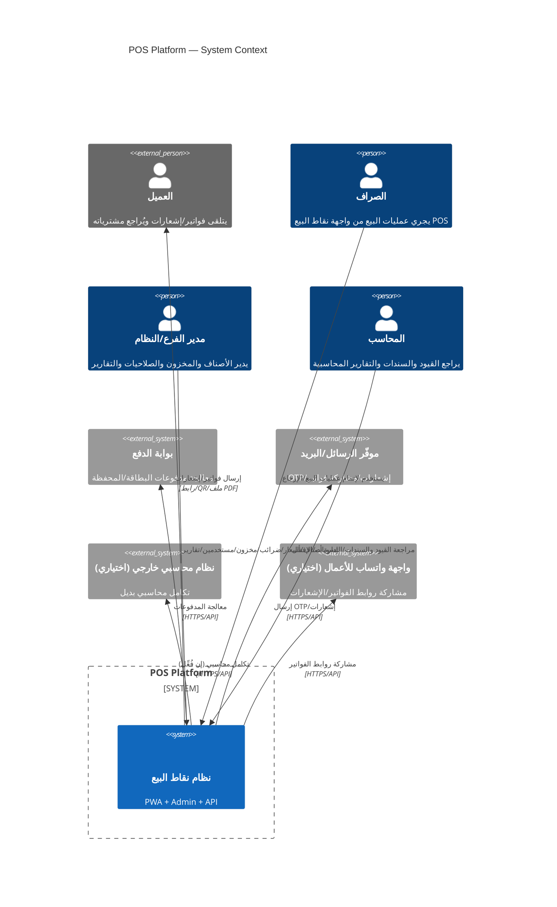
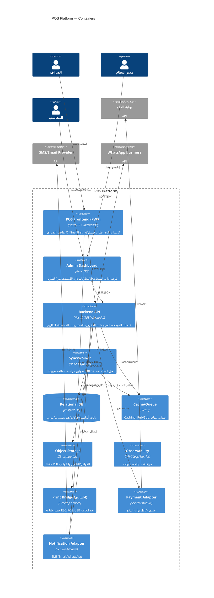
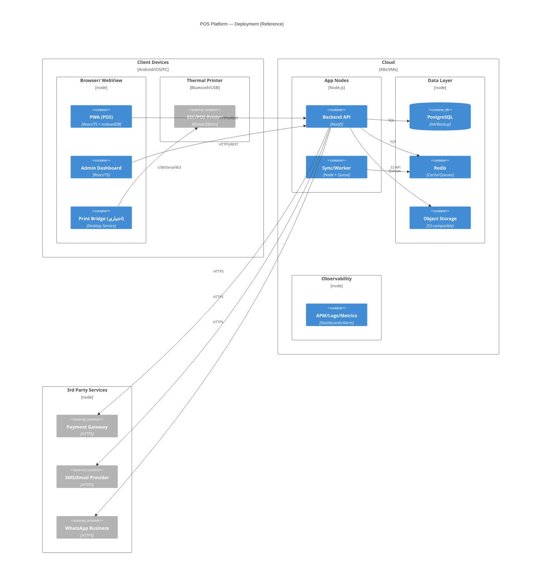
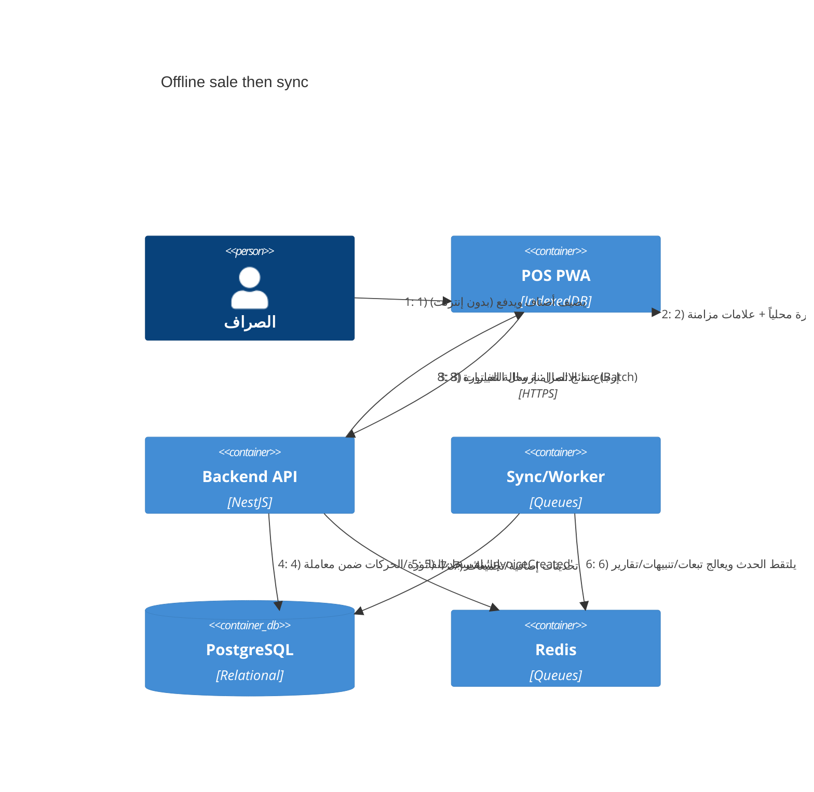

# C4 Model — نظام نقاط بيع شامل (POS Platform)
> هذا المستند بصيغة **Markdown** ويحتوي على مخططات **Mermaid (mmd)** وفق مستويات C4 (Context, Container, Component, Deployment + Dynamic).  
> المكوّنات مستخلصة من نطاق العمل: POS للصراف، مرتجعات، مخزون، مشتريات، محاسبة أساسية، تقارير، أمان متقدم، Offline‑First، تكاملات دفع/رسائل، طباعة حرارية.

---

## Level 1 — System Context (نطاق النظام وعلاقاته)

---

## Level 2 — Container Diagram (حاويات النظام)


---

## Level 3 — Component Diagram (داخل Backend API)
```mermaid
C4Component
title Backend API (NestJS) — Components

Container(api, "Backend API", "NestJS") {
  Component(gateway, "API Gateway", "HTTP Controllers", "REST/OpenAPI، تفويض/تحقق")
  Component(auth, "Auth & RBAC", "Guards/Policies", "JWT/2FA/WebAuthn، أدوار وصلاحيات")
  Component(sales, "Sales (Invoices)", "Module", "إنشاء/تعديل/طباعة/مشاركة فواتير")
  Component(returns, "Returns", "Module", "إرجاع كلي/جزئي، قيود وعكس حركة مخزون")
  Component(inventory, "Inventory", "Module", "أصناف، مخازن، حركات، تحويلات، جرد")
  Component(purchase, "Purchasing", "Module", "موردون، فواتير مشتريات، شروط دفع")
  Component(accounting, "Accounting (GL)", "Module", "دليل حسابات، قيود، سندات، إقفال")
  Component(reporting, "Reporting", "Module", "تقارير ولوحة مؤشرات، PDF/Excel")
  Component(syncMgr, "Sync Manager", "Module", "توليد تغييرات/ChangeSet، حل تعارضات")
  Component(payAdapter, "Payment Adapter", "Module", "بوابة الدفع")
  Component(notifAdapter, "Notification Adapter", "Module", "SMS/Email/WhatsApp")
  Component(audit, "Audit & Logs", "Module", "سجلات دقيقة (من/متى/ماذا/قبل-بعد)")
  Component(common, "Common/Shared", "Lib", "DTOs/Validators/Mappers")
}

ContainerDb(db, "PostgreSQL", "Relational")
Container(cache, "Redis", "Cache/Queues")
Container(store, "Object Storage (S3)", "Files")

Rel(gateway, auth, "تحقق/تفويض")
Rel(gateway, sales, "API calls")
Rel(gateway, returns, "API calls")
Rel(gateway, inventory, "API calls")
Rel(gateway, purchase, "API calls")
Rel(gateway, accounting, "API calls")
Rel(gateway, reporting, "API calls")

Rel(sales, accounting, "توليد قيود الإيرادات/الصندوق/الضريبة")
Rel(returns, accounting, "عكس الإيرادات/المخزون/الضريبة")
Rel(inventory, accounting, "تسويات/تكاليف")
Rel(purchase, accounting, "قيود المشتريات والموردين")
Rel(reporting, store, "توليد/قراءة PDF/Excel")
Rel(syncMgr, cache, "Queues/Events")
Rel(sales, db, "CRUD/Queries")
Rel(returns, db, "CRUD/Queries")
Rel(inventory, db, "CRUD/Queries")
Rel(purchase, db, "CRUD/Queries")
Rel(accounting, db, "CRUD/Queries")
Rel(reporting, db, "Queries/Aggregations")
Rel(audit, db, "Append-only logs")
Rel(payAdapter, cache, "Idempotency/Events")
Rel(payAdapter, db, "Tx records")
Rel(notifAdapter, cache, "Async send")
```

---

## Level 4 — Deployment Diagram (النشر والتشغيل)


---

## Dynamic — سيناريو: بيع Offline ثم مزامنة

